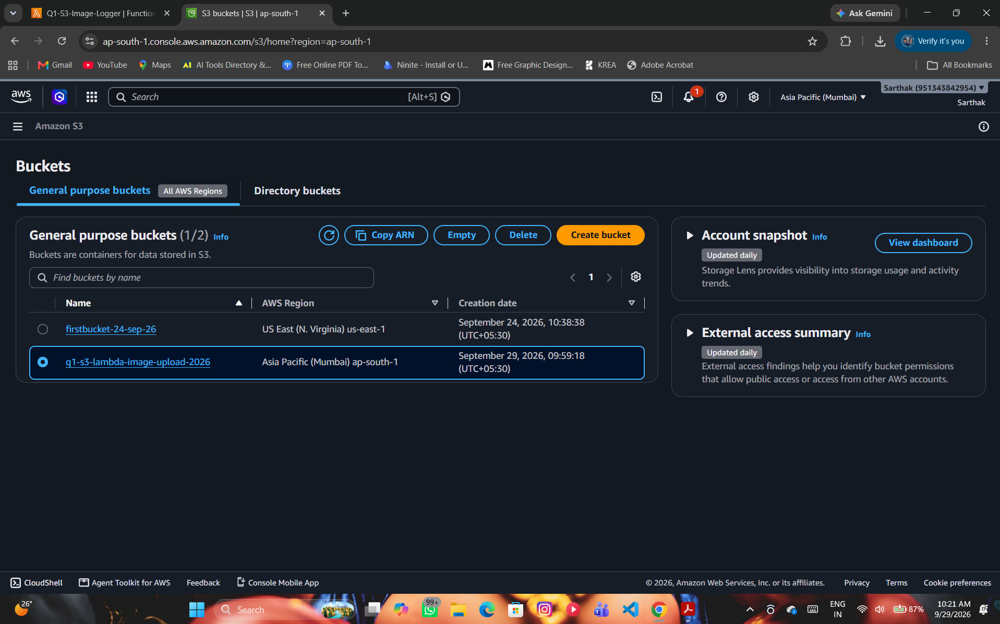
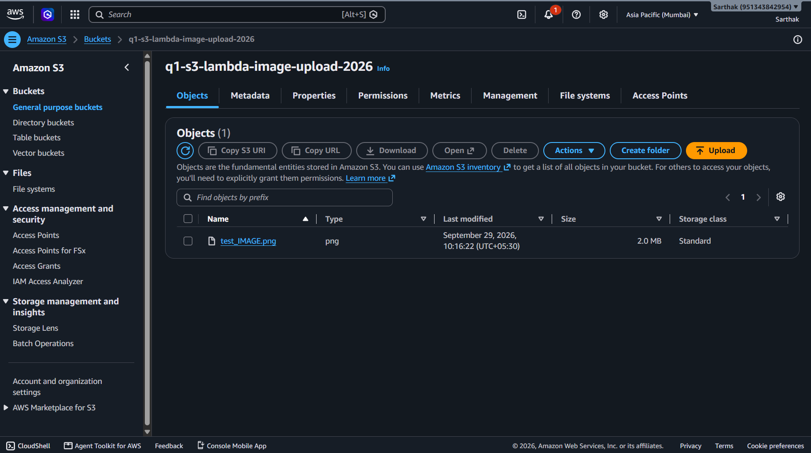
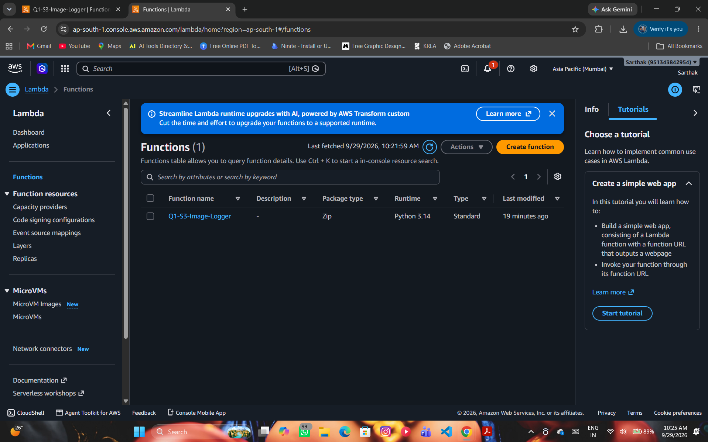
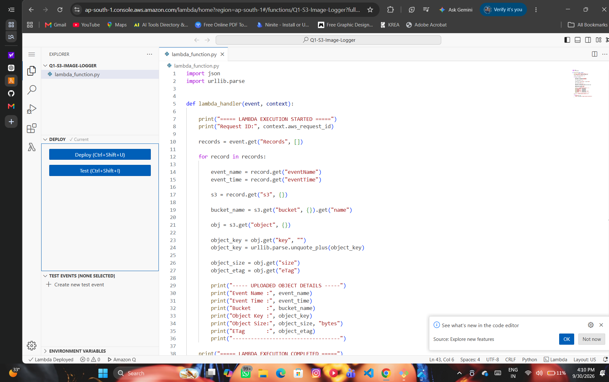
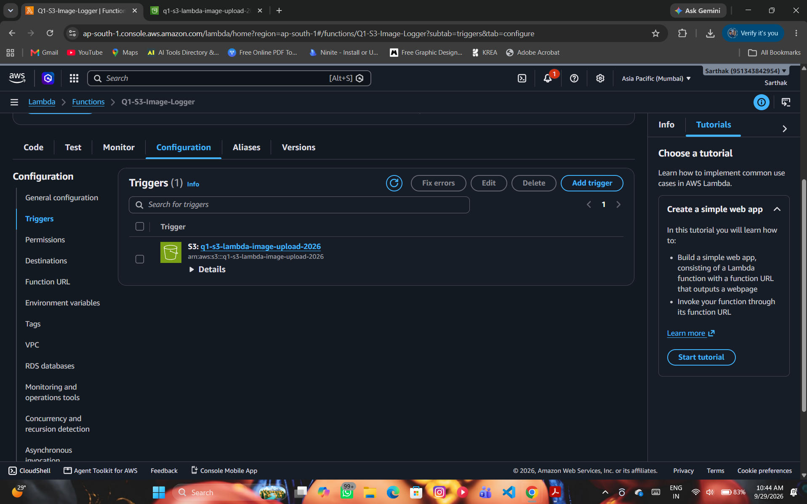
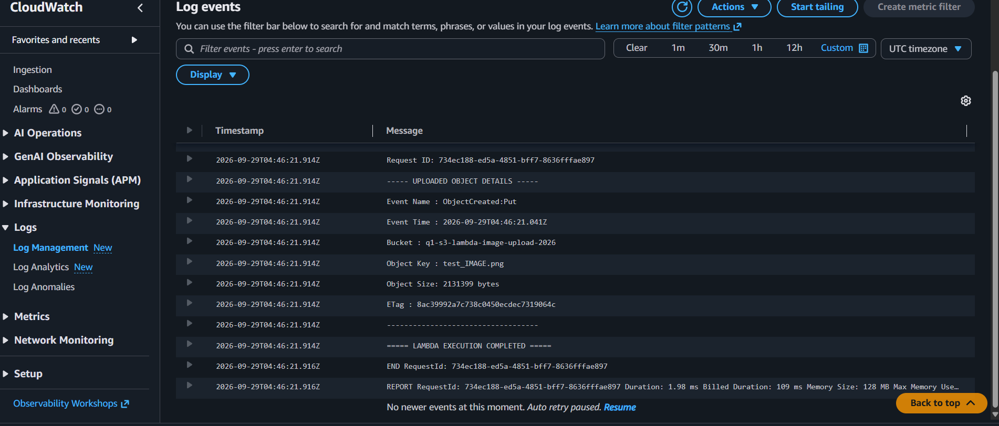

# 🚀 AWS Q1 – Serverless Image Upload Workflow

## 📌 Project Overview

This project implements a serverless image-upload workflow using Amazon S3, AWS Lambda, and Amazon CloudWatch Logs.

When an image is uploaded to an Amazon S3 bucket, an S3 ObjectCreated event automatically invokes the AWS Lambda function. The Lambda function extracts details of the uploaded object and records the execution information in Amazon CloudWatch Logs.

---

## 📌 Features Included

1. 📦 Amazon S3 bucket for image storage
2. ⚡ Automatic Lambda invocation using an S3 ObjectCreated event
3. 🔍 Extraction of uploaded object details
4. 📊 Execution logging using Amazon CloudWatch Logs
5. 🔐 AWS IAM execution permissions
6. 🧪 End-to-end testing using a sample image
7. 📸 AWS configuration and testing screenshots
8. 🏗️ Event-driven serverless architecture

---

## ☁️ AWS Services Used

| AWS Service | Purpose |
|---|---|
| 🪣 Amazon S3 | Stores uploaded images and generates ObjectCreated events |
| ⚡ AWS Lambda | Processes the S3 event and extracts object details |
| 📊 Amazon CloudWatch Logs | Stores Lambda execution logs |
| 🔐 AWS IAM | Provides required Lambda execution permissions |

---

## 🏗️ Architecture

```text
                         👤 User
                           |
                           | Upload Image
                           v
                +----------------------+
                |      Amazon S3       |
                |     Image Bucket     |
                +----------------------+
                           |
                           | ObjectCreated Event
                           v
                +----------------------+
                |      AWS Lambda      |
                |  Q1-S3-Image-Logger  |
                +----------------------+
                           |
                           | Execution Logs
                           v
                +----------------------+
                |   Amazon CloudWatch  |
                |        Logs          |
                +----------------------+
```

📄 **Detailed Architecture Documentation:**

[View Architecture Documentation](architecture/architecture.md)

---

## 🔄 Project Workflow

The complete workflow is:

```text
1. User uploads an image
          ↓
2. Image is stored in Amazon S3
          ↓
3. S3 generates an ObjectCreated event
          ↓
4. Event automatically invokes AWS Lambda
          ↓
5. Lambda receives the S3 event
          ↓
6. Lambda extracts the uploaded object's details
          ↓
7. Execution details are written to CloudWatch Logs
          ↓
8. Logs are verified for successful execution
```

---

## 🪣 S3 Bucket Configuration

### Bucket Name

```text
q1-s3-lambda-image-upload-2026
```

### AWS Region

```text
ap-south-1 (Asia Pacific - Mumbai)
```

### Public Access

```text
Block all public access: Enabled
```

### Purpose

The Amazon S3 bucket is used to store the uploaded image and generate an ObjectCreated event when a new object is created.

---

## ⚡ AWS Lambda Configuration

### Function Name

```text
Q1-S3-Image-Logger
```

### Runtime

```text
Python
```

### Trigger

```text
Amazon S3 – ObjectCreated Event
```

### Function Purpose

The Lambda function receives the S3 event, extracts the uploaded object's information, and records the execution details in CloudWatch Logs.

---

## 🔍 Lambda Object Details

The Lambda function extracts the following information from the S3 event:

- Event Name
- Event Time
- Bucket Name
- Object Key / File Name
- Object Size
- ETag
- Lambda Request ID

### Source Code

The complete Lambda source code is available here:

[📄 View `lambda_function.py`](lambda_function.py)

---

## 💻 Lambda Processing Logic

```text
S3 ObjectCreated Event
          ↓
Lambda receives event
          ↓
Extract S3 record
          ↓
Get bucket name
          ↓
Get object key
          ↓
Get object size
          ↓
Get ETag
          ↓
Print execution details
          ↓
CloudWatch Logs
```

---

## 📊 CloudWatch Logs

Amazon CloudWatch Logs is used to monitor and verify Lambda execution.

The Lambda function records information such as:

```text
===== LAMBDA EXECUTION STARTED =====

Request ID: <Lambda Request ID>

----- UPLOADED OBJECT DETAILS -----

Event Name : ObjectCreated:Put
Event Time : <Event Time>
Bucket     : q1-s3-lambda-image-upload-2026
Object Key : test_IMAGE.png
Object Size: 2131399 bytes
ETag       : <ETag>

===== LAMBDA EXECUTION COMPLETED =====
```

The CloudWatch log confirms that the Lambda function was automatically invoked after the image upload.

---

## 🧪 Testing

### Test File

```text
test_IMAGE.png
```

### Testing Procedure

1. Open the Amazon S3 bucket.
2. Upload the `test_IMAGE.png` file.
3. Verify that the image appears in the S3 bucket.
4. Verify that the S3 trigger is connected to the Lambda function.
5. Wait for the S3 ObjectCreated event.
6. Verify that Lambda was invoked.
7. Open Amazon CloudWatch Logs.
8. Open the latest log stream.
9. Verify the uploaded object's information.
10. Confirm successful Lambda execution.

---

## ✅ Testing Result

The test was completed successfully.

The image `test_IMAGE.png` was uploaded successfully to the Amazon S3 bucket.

The S3 `ObjectCreated:Put` event automatically invoked the Lambda function.

The Lambda function successfully extracted the uploaded object's details, including:

- Bucket Name
- Object Key
- Object Size
- ETag
- Event Name
- Event Time

The execution information was successfully recorded in Amazon CloudWatch Logs.

---

## 📸 Screenshots

### 1️⃣ S3 Bucket Configuration

Creation of the Amazon S3 bucket used for storing uploaded images.



---

### 2️⃣ Image Uploaded to S3 Bucket

Successful upload of the test image `test_IMAGE.png` to the Amazon S3 bucket.



---

### 3️⃣ AWS Lambda Function Configuration

Creation and configuration of the AWS Lambda function `Q1-S3-Image-Logger`.



---

### 4️⃣ Lambda Function Code

Python implementation used to process the S3 event and extract uploaded object details.



---

### 5️⃣ S3 Trigger Configuration

Amazon S3 ObjectCreated trigger configured to automatically invoke the Lambda function.



---

### 6️⃣ CloudWatch Execution Logs

Amazon CloudWatch Logs showing successful Lambda execution and details of the uploaded S3 object.



---

## 📁 Project Structure

```text
AWS-Q1-S3-Lambda-Image-Upload/
│
├── architecture/
│   └── architecture.md
│
├── screenshot/
│   ├── s3-bucket.png
│   ├── image-upload.png
│   ├── lambda-function.png
│   ├── lambda-code.png
│   ├── s3-trigger.png
│   └── cloudwatch-logs.png
│
├── lambda_function.py
└── README.md
```

---

## 🔐 Security

The project uses AWS IAM permissions for Lambda execution and CloudWatch logging.

### Security Practices

- ✅ S3 Block Public Access is enabled.
- ✅ No public access is required for the bucket.
- ✅ Lambda uses an IAM execution role.
- ✅ No AWS access keys or secrets are stored in the repository.
- ✅ No passwords or credentials are included in the project files.

---

## 🌍 Event-Driven Architecture

This project demonstrates an event-driven serverless architecture.

The Lambda function does not need to continuously run. Instead, it is triggered automatically when a new object is created in the S3 bucket.

```text
Image Upload
     ↓
Amazon S3
     ↓
ObjectCreated Event
     ↓
AWS Lambda
     ↓
CloudWatch Logs
```

---

## 🎯 Project Objective

The main objective of this project is to demonstrate how AWS services can be integrated to create an automated serverless workflow.

The project demonstrates:

- Amazon S3 object storage
- S3 event notifications
- AWS Lambda serverless execution
- Object metadata extraction
- CloudWatch logging
- Event-driven architecture

---

## 🏁 Project Outcome

The complete serverless image-upload workflow was successfully implemented and tested.

### Final Workflow

```text
Amazon S3
    ↓
ObjectCreated Event
    ↓
AWS Lambda
    ↓
CloudWatch Logs
```

The uploaded image automatically triggered the Lambda function, and the uploaded object's details were successfully recorded in CloudWatch Logs.

---

## 📚 Learning Outcomes

Through this project, the following AWS concepts were practiced:

- Amazon S3 bucket creation and object upload
- S3 event notifications
- AWS Lambda function creation
- Python-based Lambda implementation
- IAM execution roles
- Amazon CloudWatch Logs
- Serverless architecture
- Event-driven application design
- AWS Console-based configuration and testing

---

## 📝 Assignment Reference

**AWS Project Assignment – Set 7**

**Question 1: Serverless Image Upload Workflow**

The project implements the required workflow using Amazon S3, AWS Lambda, and Amazon CloudWatch Logs.

---

## 📊 Project Status

```text
Status       : ✅ Completed
Environment  : AWS
Region       : ap-south-1 (Mumbai)
Architecture : Serverless
```

---

## 🙌 Conclusion

This project successfully demonstrates an automated serverless image-upload workflow using AWS.

Whenever an image is uploaded to the Amazon S3 bucket, an ObjectCreated event automatically invokes the Lambda function. The function extracts the uploaded object's details and records the execution information in Amazon CloudWatch Logs.

The complete workflow was successfully tested using `test_IMAGE.png`.

---

⭐ **AWS Serverless Image Upload Workflow – Q1**
